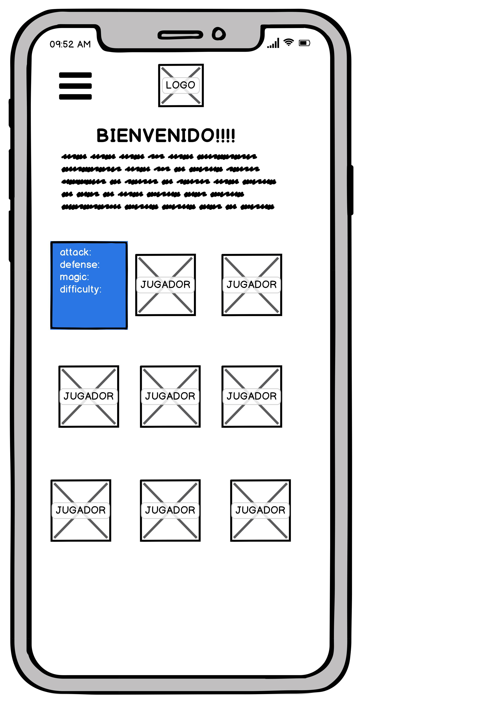

# LEAGE OF LEGENDS
<figure>

</figure>

## Índice

* [1. Resumen del proyecto](#1-resumen-del-proyecto)
* [2. Objetivos de aprendizaje](#2-objetivos-de-aprendizaje)
* [3. Criterios de aceptación mínimos del proyecto](#3-criterios-de-aceptación-mínimos-del-proyecto)
* [4. Checklist](#4-checklist)

***

## 1. Resumen del proyecto

En este proyecto la idea principal es permitir a los Fans de Leage Of Legends poder hacer filtros de sus campeones por tipo de rol y poderlos organizar de forma desendente o ascendente. 

## 2. Objetivos de aprendizaje

### HTML y CSS

* [X] [Uso de HTML semántico.](https://developer.mozilla.org/en-US/docs/Glossary/Semantics#Semantics_in_HTML)
* [X] Uso de selectores de CSS.
* [X] Construir tu aplicación respetando el diseño realizado (maquetación).
* [X] [Uso de flexbox en CSS.](https://css-tricks.com/snippets/css/a-guide-to-flexbox/)

### DOM y Web APIs

* [X] Uso de selectores del DOM.
* [X] Manejo de eventos del DOM.
* [X] [Manipulación dinámica del DOM.](https://developer.mozilla.org/es/docs/Referencia_DOM_de_Gecko/Introducci%C3%B3n)
(appendChild |createElement | createTextNode| innerHTML | textContent | etc.)

### JavaScript

* [X] Uso de condicionales (if-else | switch | operador ternario)
* [X] Uso de bucles (for | for..in | for..of | while)
* [X] Uso de funciones (parámetros | argumentos | valor de retorno)
* [X] Manipular arrays (filter | map | sort | reduce)
* [ ] Manipular objects (key | value)
* [X] Uso ES modules ([`import`](https://developer.mozilla.org/en-US/docs/Web/JavaScript/Reference/Statements/import)
| [`export`](https://developer.mozilla.org/en-US/docs/Web/JavaScript/Reference/Statements/export))
* [ ] Diferenciar entre expression y statements.
* [ ] Diferenciar entre tipos de datos atómicos y estructurados.

### Testing

* [ ] [Testeo unitario.](https://jestjs.io/docs/es-ES/getting-started)

### Estructura del código y guía de estilo

* [X] Organizar y dividir el código en módulos (Modularización)
* [X] Uso de identificadores descriptivos (Nomenclatura | Semántica)
* [ ] Uso de linter (ESLINT)

### Git y GitHub

* [X] Uso de comandos de git (add | commit | pull | status | push)
* [X] Manejo de repositorios de GitHub (clone | fork | gh-pages)
* [X] Colaboración en Github (branches | pull requests | |tags)

### UX

* [X] Diseñar la aplicación pensando y entendiendo al usuario.
* [X] Crear prototipos para obtener feedback e iterar.
* [X] Aplicar los principios de diseño visual (contraste, alineación, jerarquía)
* [X] Planear y ejecutar tests de usabilidad.

## 5. Criterios de aceptación mínimos del proyecto

### Definición del producto

Documenta brevemente tu trabajo en el archivo `README.md` de tu repositorio,
contándonos cómo fue tu proceso de diseño y cómo crees que el producto resuelve
el problema (o problemas) que tiene tu usuario.

### Diseño de la Interfaz de Usuario

<figure>

<figcaption>Primeros prototipos</figcaption>
</figure>

<figure>

<figcaption>Primeros prototipos</figcaption>
</figure>

#### Prototipo de baja fidelidad
<figure>

<figcaption>Prototipos de baja fidelidad</figcaption>
</figure>

<figure>

<figcaption>Prototipos de baja fidelidad</figcaption>
</figure>

<figure>

<figcaption>Prototipos de baja fidelidad</figcaption>
</figure>

<figure>

<figcaption>Prototipos de baja fidelidad</figcaption>
</figure>

<figure>

<figcaption>Prototipos de baja fidelidad</figcaption>
</figure>

#### Prototipo de alta fidelidad

<figure>

<figcaption>Prototipos de alta fidelidad</figcaption>
</figure>

## 9. Checklist

* [X] Usa VanillaJS.
* [X] No hace uso de `this`.
* [X] Pasa linter (`npm run pretest`)
* [ ] Pasa tests (`npm test`)
* [ ] Pruebas unitarias cubren un mínimo del 70% de statements, functions y
  lines y branches.
* [X] Incluye _Definición del producto_ clara e informativa en `README.md`.
* [ ] Incluye historias de usuario en `README.md`.
* [X] Incluye _sketch_ de la solución (prototipo de baja fidelidad) en
  `README.md`.
* [X] Incluye _Diseño de la Interfaz de Usuario_ (prototipo de alta fidelidad)
  en `README.md`.
* [ ] Incluye link a Zeplin o Figma en `README.md`.
* [ ] Incluye el listado de problemas que detectaste a través de tests de
  usabilidad en el `README.md`.
* [X] UI: Muestra lista y/o tabla con datos y/o indicadores.
* [X] UI: Permite ordenar data por uno o más campos (asc y desc).
* [X] UI: Permite filtrar data en base a una condición.
* [X] UI: Es _responsive_.
